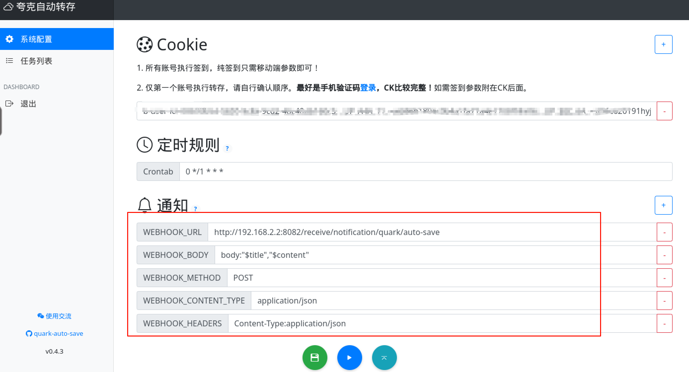
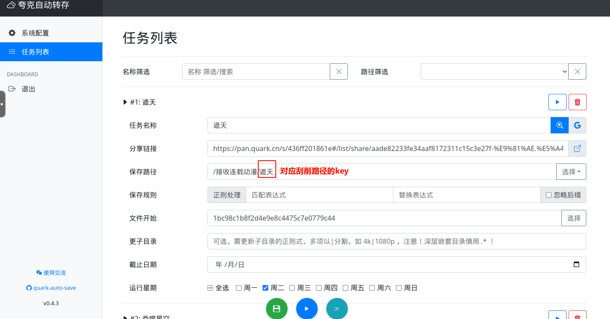
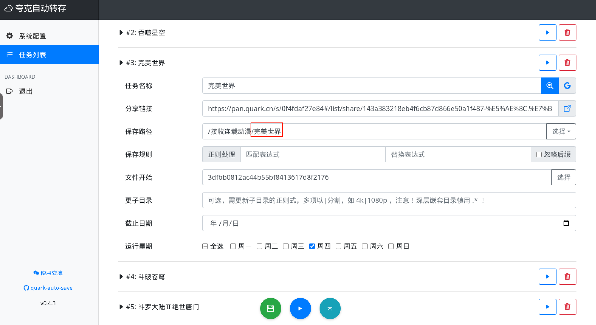

# sgys-media-tools

#### 介绍
媒体库工具：strm工具、网盘、alist等等
1. 利用alist，可以全量生成strm文件，并下载图片及nfo等相关文件。
2. 通过监听115生活事件，实现增量数据入库，自动生成strm文件，下载图片及nfo文件。
3. 结合[quark-auto-save](https://github.com/Cp0204/quark-auto-save)项目，可自动化完成追剧、刮削信息、入库操作（必须指定其他网盘）。

#### 安装教程
##### 通过Docker安装
**docker-compose.yml**

```yml
services:
  sgys-media-tools:
    container_name: sgys-media-tools
    image: sgys-media-tools:1.0
    network_mode: bridge 
    environment:
      TZ: Asia/Shanghai
      #JAVA_OPTS: -Dloader.path=lib -Dfile.encoding=utf-8 -Xms256m -Xmx256m -Xss256k -XX:MetaspaceSize=64m -XX:+UseG1GC -XX:MaxGCPauseMillis=100 -XX:+AlwaysPreTouch -XX:-OmitStackTraceInFastThrow #Docerfile中有默认配置，可在此处选择覆盖
      SPRINGBOOT_OPTS: --logging.config=/app/config/logback.xml
    volumes:
      - /etc/localtime:/etc/localtime:ro
      - /data/sgys-media-tools/logs:/app/logs
      - /data/sgys-media-tools/config/application.yml:/app/config/application.yml
      - /data/sgys-media-tools/db:/app/db
      - /mnt/strm:/mnt/strm
    ports:
      - 8082:8080
    restart: always

```
#### 配置文件
**applition.yml**
```yml
app:
  apiRateLimit: 1  # API 速率限制
  downloadMediaFile: true  # 是否下载媒体文件
  # alist配置
  alist:
    token: alist-39c5876b-956d-4f2c-8bd3-e280439e313214141414hbc3mAyp3l7sb8AlTkT  # alist token
    url: http://127.0.0.1:5244  # alist地址
    mediaUrl: http://127.0.0.1:5244/d  # alist媒体地址
    driver115Path: /115网盘  # alist115网盘路径
    # 待处理媒体路径,不全量生成strm文件，则无需此配置
    mediaPath:
      - /115网盘/电视剧
      - /115网盘/电影
    # 刮削路径
    scrapPath:
      "[完美世界]": /115网盘/未刮削/连载动漫/完美世界 (2021)/Season 1
      "[遮天]": /115网盘/未刮削/连载动漫/遮天 (2023)/Season 1
    # 文件最终保存路径
    serializedTvShow:
      "[完美世界 (2021)]": /115网盘/动漫/国漫/完美世界 (2021)/Season 1
      "[遮天 (2023)]": /115网盘/动漫/国漫/遮天 (2023)/Season 1
  # 服务器配置
  server:
    basePath: /mnt/strm   # 媒体文件本地保存路径
    driver115Path: /mnt/strm/115网盘  # 115网盘本地保存路径
  # 115网盘配置
  driver115:
    enabled: true   # 是否开启115网盘生活监听
    intervalMinutes: 30  # 监听间隔
    cookie: UID=341890318_R2_1731548315;CID=0af3d63b41417f3b292;SEID=7456fe87bf1a4214140d5f3b7f2360682f6ab8e5b965231ce10942141751c7
    # 忽略文件夹
    ignoreFolders:
      - /未刮削
      - /音乐
      - /云下载
  # tinymediamanger配置
  ttm:
    enabled: false   # 是否开启ttm刮削
    url: http://127.0.0.1:7878/api/tvshows
    apiKey: 3684ce7c-8917-4a75-af06-6be611bafbe5
    scrapTime: 600 # 刮削时间，单位：秒
  # cd2配置
  cloud-drive:
    enabled: false   # 是否开启cd2刮削，不开启则默认刮削为alist挂载到本地的路径（通过ttm刮削alist挂载的115可能会有垃圾文件未删除，强迫症建议打开cd2，不在意的话关闭即可）
    url: http://127.0.0.1:19798
    username: 1144804894@qq.com
    password: 123456

feign:
  okhttp:
    enabled: true
http:
  logLevel: none

spring:
  datasource:
    #    driver-class-name: com.mysql.cj.jdbc.Driver
    #    url: jdbc:mysql://192.168.30.78:3306/media?useUnicode=true&characterEncoding=utf-8&useSSL=false&serverTimezone=Asia/Shanghai
    url: jdbc:h2:file:./db/media;AUTO_RECONNECT=TRUE
    username: sa
    password:
    driver-class-name: org.h2.Driver
  sql:
    init:
      schema-locations: classpath:config/init.sql
      mode: never
  h2:
    console:
      enabled: true
      settings:
        web-allow-others: true
        web-admin-password: 123456
```

#### quark-auto-save配置

> WEBHOOK_URL：**http://127.0.0.1:8082/receive/notification/quark/auto-save**

> WEBHOOK_BODY：**body:"\$title","\$content"**

> WEBHOOK_METHOD：**POST**

> WEBHOOK_CONTENT_TYPE：**application/json**

> WEBHOOK_HEADERS：**Content-Type:application/json**




#### 参与贡献

1.  Fork 本仓库
2.  新建 Feat_xxx 分支
3.  提交代码
4.  新建 Pull Request
