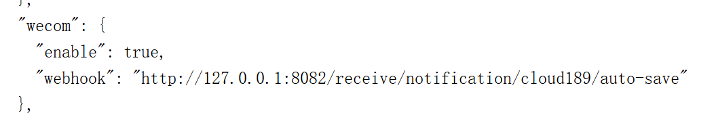

# sgys-media-tools

#### 介绍
媒体库工具：strm工具、网盘、alist等等
1. 利用alist，可以全量生成strm文件，并下载图片及nfo等相关文件。
2. 通过监听115生活事件，实现增量数据入库，自动生成strm文件，下载图片及nfo文件。
3.
结合[quark-auto-save](https://github.com/Cp0204/quark-auto-save)、[cloud189-auto-save](https://github.com/1307super/cloud189-auto-save)
等项目，可自动化完成追剧、刮削信息、入库操作。

#### 安装教程
##### 通过Docker安装
**docker-compose.yml**

```yml
services:
  sgys-media-tools:
    container_name: sgys-media-tools
    image: sgys-media-tools:2.0
    network_mode: bridge 
    environment:
      TZ: Asia/Shanghai
    volumes:
      - /etc/localtime:/etc/localtime:ro
      - /data/sgys-media-tools/logs:/app/logs
      - /data/sgys-media-tools/config/application.yml:/app/config/application.yml
      - /data/sgys-media-tools/config/application-media.yml:/app/config/application-media.yml
      - /data/sgys-media-tools/db:/app/db
      - /mnt/strm:/mnt/strm
    ports:
      - 8082:8080
    restart: always

```
#### 配置文件

**applition-media.yml**
```yml
app:
  apiRateLimit: 1  # API 速率限制
  downloadMediaFile: true  # 是否下载媒体文件
  encodeStrmPath: true   # 是否编码strm路径
  # alist配置
  alist:
    token: alist-39c51876b-956d-4f2c-8243-e280439243YcXc2424ivJ6J3oHzgXVItn245222222cG7goPpUIX42HP2T44ClK06rhbcsb8AlTkT  # alist token
    url: http://113.45.219.178:5244  # alist地址
    mediaUrl: http://127.0.0.1:5244/d  # alist媒体地址
    driver115Path: /115网盘  # alist115网盘路径
    # 待处理媒体路径
    #    mediaPath:
    #      - /115网盘/电视剧
    #      - /115网盘/电影
    #      - /115网盘/综艺
    #      - /115网盘/纪录片
    #      - /115网盘/节目晚会
    # 刮削路径
    scrapPath:
      "[斗罗大陆2绝世唐门]": /115网盘/未刮削/连载动漫/斗罗大陆Ⅱ绝世唐门 (2023)/Season 1
      "[斗破苍穹]": /115网盘/未刮削/连载动漫/斗破苍穹 (2017)/Season 5
      "[吞噬星空]": /115网盘/未刮削/连载动漫/吞噬星空 (2020)/Season 1
      "[完美世界]": /115网盘/未刮削/连载动漫/完美世界 (2021)/Season 1
      "[遮天]": /115网盘/未刮削/连载动漫/遮天 (2023)/Season 1
      "[凡人修仙传]": /115网盘/未刮削/连载动漫/凡人修仙传 (2020)/Season 7
      "[棋士]": /天翼云盘/未刮削/连载电视/棋士 (2025)/Season 1
    # 文件最终保存路径
    serializedTvShow:
      "[斗罗大陆Ⅱ绝世唐门 (2023)]": /115网盘/动漫/国漫/斗罗大陆Ⅱ绝世唐门 (2023)/Season 1
      "[斗破苍穹 (2017)]": /115网盘/动漫/国漫/斗破苍穹 (2017)/Season 5
      "[吞噬星空 (2020)]": /115网盘/动漫/国漫/吞噬星空 (2020)/Season 1
      "[完美世界 (2021)]": /115网盘/动漫/国漫/完美世界 (2021)/Season 1
      "[棋士 (2025)]": /天翼云盘/电视剧/棋士 (2025)/Season 1
  # 服务器配置
  server:
    basePath: /mnt/strm   # 媒体文件本地保存路径
    driver115Path: /mnt/strm/115网盘  # 115网盘本地保存路径
  # 115网盘配置
  driver115:
    enabled: false   # 是否开启115网盘生活监听
    intervalMinutes: 30  # 监听间隔
    cookie: UID=341890318_D1_1740142749;CID=cae3a0b208kd675e45f2sdc2245dda4d9;SEID=7405c2ad1b10c90646c1342378b8e403ab543ce17b243ca99b0cf5b568ed8dd213132c1d62309e76729bbad2ec;KID=7297fc8a238a0db9ff6b9b8916dff66d
    # 忽略文件夹
    ignoreFolders:
      - /未刮削
      - /音乐
      - /云下载
      - /我的接收
      - /游戏
  driverQuark:
    handleFolders:
      - /接收连载电视
      - /接收连载动漫
  driverCloud189:
    handleFolders:
      - /接收连载电视
      - /接收连载动漫
  # tinymediamanger配置
  ttm:
    enabled: false   # 是否开启ttm刮削
    url: http://127.0.0.1:7878/api/tvshows
    apiKey: 3684ce7c-8917-4a75-af06-6be611bafbe5
    scrapTime: 60 # 刮削时间
  # cd2配置
  cloud-drive:
    enabled: false   # 是否开启cd2刮削，不开启则默认刮削为alist挂载到本地的路径
    url: http://127.0.0.1:19798
    username: 1144804894@qq.com
    password: 123456
  emby:
    url: http://127.0.0.1:8096
    apiKey: 213214adsagfgasdgasga
    user-id: 123kskjjfafasf
  episodeGroup:
    - 凡人修仙传|S01E135-S01E152 -> S07E11-S07E28
```

**application.yml**

```yml
# telegram机器人配置
telegrambots:
  enabled: false
  token: 81997859:AASSEm9iV_8Q23216xc-dsadBpn2Xwdaysj415aZzc
  chat-id: 56136141
  proxy:
    hostname: 192.168.2.3
    port: 7890
```

#### quark-auto-save配置

> WEBHOOK_URL：**http://127.0.0.1:8082/receive/notification/quark/auto-save**

> WEBHOOK_BODY：**body:"\$title","\$content"**

> WEBHOOK_METHOD：**POST**

> WEBHOOK_CONTENT_TYPE：**application/json**

> WEBHOOK_HEADERS：**Content-Type:application/json**


#### cloud189-auto-save配置

config.json文件配置推送路径



#### emby通知配置

##### 神医通知


##### tg机器人通知效果


#### 参与贡献
